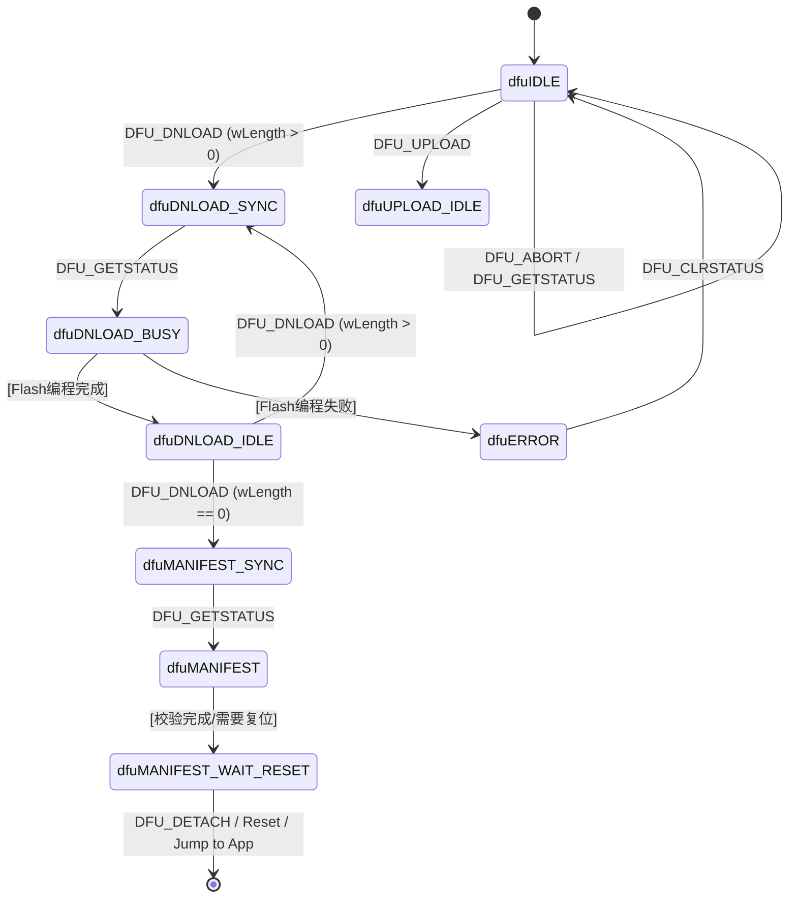

# STM32U5 USB DFU (Device Firmware Upgrade) 实现方案与计划

本文档详细规划了在 `u5-lib` 库（基于 Embassy / STM32U5）中实现 **USB DFU 1.1 Class (Device Firmware Upgrade)** 的整体架构、控制协议状态机、Flash 驱动集成以及逐步实施计划。

---

## 1. DFU 协议规范与架构概述 (USB DFU 1.1)

USB DFU 规范定义了标准的固件升级机制，无需专用的 JTAG/ST-Link 烧录器。主控端可直接通过标准命令行工具 `dfu-util` 或 WebUSB 网页端对设备进行固件刷写。

### 1.1 双模式设计

1. **Runtime 模式 (应用程序模式)**
   - 主程序运行在 Application 分区。
   - 暴露 DFU Functional Descriptor（功能描述符），声明支持 DFU 能力。
   - 监听 Control Pipe (Endpoint 0) 上的 `DFU_DETACH` 请求。收到请求后，软复位或直接跳转至 DFU Bootloader 分区。
2. **DFU 模式 (Bootloader 模式)**
   - 独立的 Bootloader 固件运行在 Flash 块 0（地址 `0x0800_0000`）。
   - 暴露完整 DFU 接口 (Class `0xFE`, SubClass `0x01`, Protocol `0x02`)。
   - 处理固件下载、 Flash 页擦除、Flash 写入、校验及跳转到 App。

---

## 2. DFU 状态机设计

USB DFU v1.1 规范要求实现严格的状态机。所有的 DFU 控制请求均通过 **Endpoint 0 (Control Endpoint)** 完成。



### 2.1 核心 DFU Request 命令集

| 请求指令 | bRequest 值 | 方向 | 功能描述 |
| :--- | :--- | :--- | :--- |
| `DFU_DETACH` | `0x00` | Host -> Dev | 请求设备脱离 Runtime 模式并切入 DFU 模式 |
| `DFU_DNLOAD` | `0x01` | Host -> Dev | 发送固件数据包 (wBlockNum, Data)，wLength=0 表示传输结束 |
| `DFU_UPLOAD` | `0x02` | Dev -> Host | 读取设备固件数据包 |
| `DFU_GETSTATUS` | `0x03` | Dev -> Host | 查询当前状态、错误码及下一次查询等待时间 (`bwPollTimeout`) |
| `DFU_CLRSTATUS` | `0x04` | Host -> Dev | 清除错误状态并重置为 `dfuIDLE` |
| `DFU_GETSTATE` | `0x05` | Dev -> Host | 获取当前 1 字节状态 ID |
| `DFU_ABORT` | `0x06` | Host -> Dev | 中断当前传输并重置到 `dfuIDLE` |

---

## 3. Flash 分区与 Bootloader 跳转机制 (STM32U5)

### 3.1 Flash 内存布局 (以 2MB STM32U575/U5A5 为例)

STM32U5 支持 8KB/128KB 页/扇区擦除。

```
+-------------------+ 0x0800_0000  (Bootloader 分区, 64 KB)
|  DFU Bootloader   |  包含 USB OTG 驱动 + DFU 状态机 + Flash 擦写驱动
+-------------------+ 0x0801_0000  (Application 分区, 1920 KB)
|                   |  Vector Table (VTOR) 指向 0x0801_0000
|  User Application |  应用固件镜像
|                   |
+-------------------+ 0x0820_0000 (Flash 结束)
```

### 3.2 Bootloader 跳转至 Application 流程

Bootloader 在接收完完整镜像或上电检测到无需 DFU 时，执行跳转：
1. 检查 App 地址 (`0x0801_0000`) 的栈指针 SP 是否有效 (落在 SRAM 范围内)。
2. 关闭所有外设中断，禁用 SysTick，清空 NVIC 挂起状态。
3. 重定向 VTOR：`SCB->VTOR = 0x0801_0000`。
4. 设置 Main Stack Pointer (MSP)：`__set_MSP(*(uint32_t*)0x0801_0000)`。
5. 跳转至 Reset Handler：`((void (*)()) (*(uint32_t*)0x0801_0004))()`。

---

## 4. 实施路线图 (Implementation Plan)

### Phase 1: STM32U5 Flash 擦写驱动 (`src/flash.rs`)
- [ ] 实现 STM32U5 Flash 控制器解锁与锁定 (`KEYR`)。
- [ ] 实现指定页的异步/同步 Page Erase。
- [ ] 实现 Quad-Word / Quad-Double-Word 写入 (STM32U5 128-bit 写入粒度)。
- [ ] 封装校验读取与 ICACHE/DCACHE 清刷。

### Phase 2: DFU 描述符与控制请求处理 (`src/usb/dfu.rs`)
- [ ] 定义 DFU Functional Descriptor 结构体 (Attributes, wDetachTimeout, wTransferSize)。
- [ ] 实现基于 `embassy-usb` 的 `ControlHandler` 接口，拦截 Class 特定请求。
- [ ] 实现完整的 DFU 1.1 状态机，维护 `bStatus`、`bState` 与 `bwPollTimeout`。
- [ ] 缓存 `DFU_DNLOAD` 接收到的数据块包，按 Flash 页对齐触发擦除与写入。

### Phase 3: Runtime 模式与 Detach 软复位
- [ ] 在 `u5-lib` 中增加 Runtime DFU Handler。
- [ ] 当应用收到 `DFU_DETACH` 时，记录 Boot Flag 到 RTC Backup Register / SRAM，并触发 `NVIC_SystemReset()`。

### Phase 4: Bootloader 独立测试用例与 `dfu-util` 联调
- [ ] 编写测试脚本/用例 `tests/usb_dfu.rs`。
- [ ] 使用标准工具 `dfu-util -l` 测试描述符识别。
- [ ] 运行固件刷写测试：`dfu-util -a 0 -s 0x08010000:leave -D app.bin` 验证全流程擦写与跳转成功。

---

## 5. 开发建议与后续步骤

目前 `u5-lib` 已经具备完善的 `usb_synopsys_otg` 驱动底层（通过 `embassy-usb`）。按照上述步骤先实现 `flash.rs` 擦写驱动，再添加 `usb/dfu.rs` 的控制请求拦截器，即可快速落地 USB DFU 功能。
